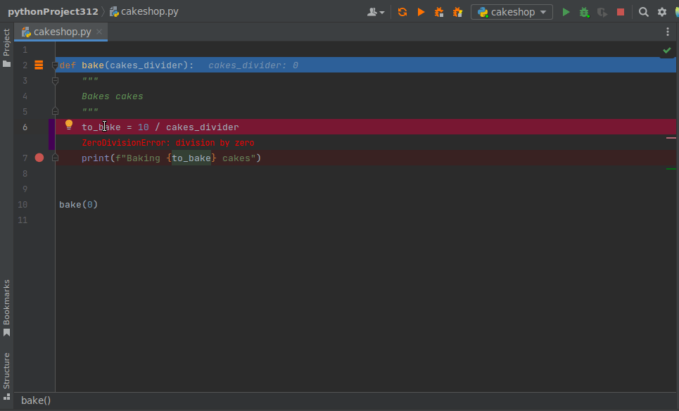

.. raw:: html

    

        
    

    <h3 align="center"> Advanced Hot Reloading & Profiling </h3>

.. class:: center

.. raw:: html

    

        
    

    

        
    

**Examples above are run in debug mode with added breakpoint.**

Details
#######

.. image:: https://badge.fury.io/py/reloadium.svg
    :target: https://badge.fury.io/py/reloadium

.. image:: https://img.shields.io/jetbrains/plugin/v/18509-reloadium
    :target: https://plugins.jetbrains.com/plugin/18509-reloadium

.. image:: https://img.shields.io/jetbrains/plugin/d/18509-reloadium
    :target: https://plugins.jetbrains.com/plugin/18509-reloadium

.. image:: https://img.shields.io/jetbrains/plugin/r/stars/18509-reloadium
    :target: https://plugins.jetbrains.com/plugin/18509-reloadium

| Reloadium adds hot reloading, profiling and AI features to your IDE

Installing
##########

| If you are a PyCharm user please check out `Reloadium plugin <https://plugins.jetbrains.com/plugin/18509-reloadium>`_
| Plugins for other IDEs are coming soon.

| Reloadium can be also used as a standalone library by installing it manually with pip:

.. code-block:: console

   pip install reloadium

Using
#####

Running python files:

.. code-block:: console

   reloadium run example.py

Running modules:

.. code-block:: console

   reloadium run -m my_module

| To apply your changes simply save a file

AI
######

| Reloadium integrates with ChatGpt seamlessly providing additional context to your conversations resulting in much better replies.

General Python Features
#######################

| When altered, Reloadium will execute the current function again, providing developers with immediate feedback on the functionality of their code.

.. image:: media/frame_reloading.gif
    :width: 700
    :alt: Frame Reloading

| Reloadium manages errors that occur while reloading functions, allowing you to correct any mistakes seamlessly.

.. image:: media/fixing_errors.gif
    :width: 700
    :alt: Frame Reloading

| Reloadium has the ability to refresh files throughout the entire project by tracking dependencies.

.. image:: media/multi_file_reloading.gif
    :width: 700
    :alt: Frame Reloading

Django
######

| Upon saving, Reloadium performs hot reloading of views and automatically refreshes the page.

.. image:: media/django_page_refreshing.gif
    :width: 700
    :alt: Page Refreshing

| To avoid generating undesired objects after reloading the current function, Reloadium reverts any database modifications.

.. image:: media/django_rolling_back.gif
    :width: 700
    :alt: Rolling back db

Flask
#####

| Reloadium hot reloads Flask apps and automatically refreshes the page upon saving. 
| This enables real-time content updates, significantly streamlining web development.

.. image:: media/flask.gif
    :width: 700
    :alt: Flask

SqlAlchemy
##########

| Reloadium will rollback database changes to prevent creating unwanted objects after reloading current function.

.. image:: media/sqlalchemy.gif
    :width: 700
    :alt: SqlAlchemy

Pandas
##########

| Reloadium facilitates hot reloading of Pandas objects, making the manipulation of intricate dataframes for data science remarkably simple.

.. image:: media/pandas.gif
    :width: 700
    :alt: Pandas